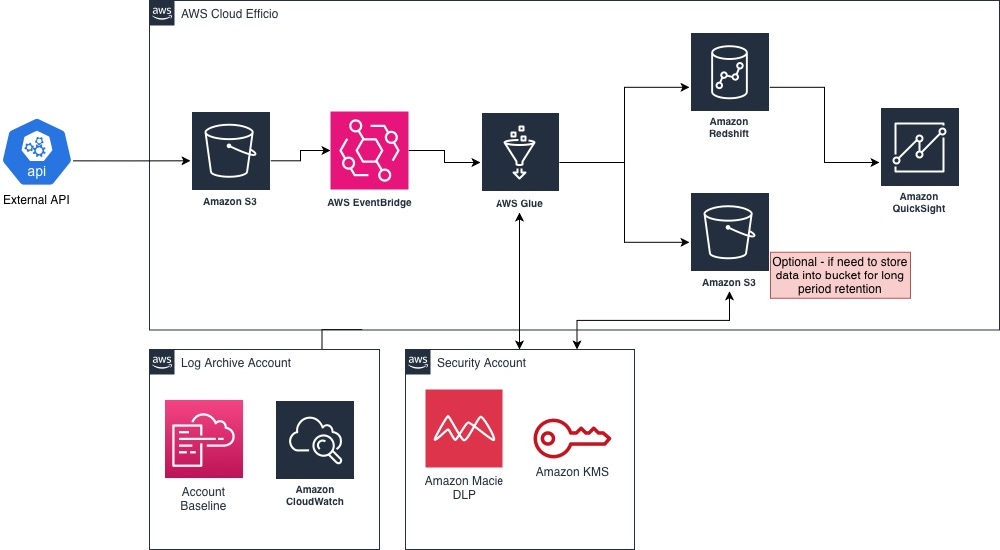

# Jefferson F Ferreira Solution

## Pipeline execution
**Virtual environment:** source venv/bin/activate \
**Requirements:** pip install -r requirements.txt \
**Path:** ./spark-batch-pipeline \
**Cmd:** make run \

## Logic flow - Data Lake
**Upload Folder:** ./JeffSolution/workingArea/uploads
1. Ingestion on **ODS** - Staging Area
   - Raw data
   - Split between data_blocks and family_tree
   - Start of control
2. Ingestion on **DW** - Warehouse
   - Check company mandatory identification
   - Quarantine ingestion if needed
   - Split into relational tables
3. Ingestion on **APP** - Data Mart
   - Create a fictional APP view

## Datasets - Parquet
**Database:** parquet files at ./JeffSolution/dataIngestion \
- CONTROL
  * tb_pipeline_control
  * tb_quarantine_files
- ODS
  * ods_datablocks_raw
  * ods_familytree_raw
- DW
  * dw_company_data
  * dw_industry_code
  * dw_stock_exchanges
  * dw_family_tree
  * dw_family_tree_members
- APP
  * app_stocks_by_company

## Entity-Relationship Diagram (ERD)


## Scaling for AWS Modules
### Batch
| AWS Modules | Comments |
| :--- | :--- |
| Amazon S3 | Files from source is ingested into input Bucket (multi-region for disaster recovery) from External API |
| Amazon EventBridge | Start an event to notify the Amazon Glue after receiving a file |
| Amazon Glue | Adapt to use Apache Spark (runners) for ingestion |
| Amazon Macie | To discover and classify PIIs (De-identify and Inspec) |
| Amazon KMS | Specific project to handle all encrypted key |
| Amazon Redshift | Analytics data warehouse for storage and query (tables, quarantine and failed rows ingestion) |
| Amazon S3 | Optional output bucket for long time retention |
| Amazon QuickSight | To create business dashboards |
| CloudWatch | For log and metrics about the system modules |
| Account Baseline | Defining the user access and permissions |



## Adjusts for other Cloud environment 

| Google Cloud | Comments |
| :--- | :--- |
| Cloud Storage | Storage for input or output files |
| PubSub | Send notification for subscribers start processing |
| Cloud Function | Consumer of PubSub messages and call Dataflow for start ingestion|
| GCP Dataproc | Apache Spark for ingestion |
| Cloud DLP | PII encryption |
| Cloud KMS | Management Key - in dedicated project |
| BigQuery | Analytics database  |
| Looker | Business dashboards |
| Cloud Monitoring | For log and metrics |
| Cloud IAM | Define user and Service Accounts roles and permitions |

For **Oracle** or **Azure**, I don't have much modules knowledge to design the solution.

## Folder hierarchy
``` bash
JeffSolution
├── README.md
├── datasets
│   ├── app
│   │   └── app_stocks_by_company
│   ├── control
│   │   ├── tb_pipeline_control
│   │   └── tb_quarantine_files
│   ├── dw
│   │   ├── dw_company_data
│   │   ├── dw_family_tree
│   │   ├── dw_family_tree_members
│   │   ├── dw_industry_code
│   │   └── dw_stock_exchanges
│   └── ods
│       ├── ods_datablocks_raw
│       └── ods_familytree_raw
├── docs
│   ├── Arquitecture_AWS.jpg
│   └── Arquitecture_ERD.jpg
├── pipeline_config.json
├── requirements.txt
├── src
│   ├── __init__.py
│   ├── commons
│   │   ├── __init__.py
│   │   ├── config_loader.py
│   │   ├── execution_tracker.py
│   │   └── logger_setup.py
│   ├── core
│   │   ├── __init__.py
│   │   ├── ods_ingestor.py
│   │   └── spark_manager.py
│   ├── main.py
│   └── utils
│       ├── mandatory_fields.json
│       └── whitelist.json
├── tests
│   ├── test_commons.py
│   ├── test_ods_ingestion.py
│   └── test_spark.py
└── workingArea
    ├── processedFiles
    └── uploads

```